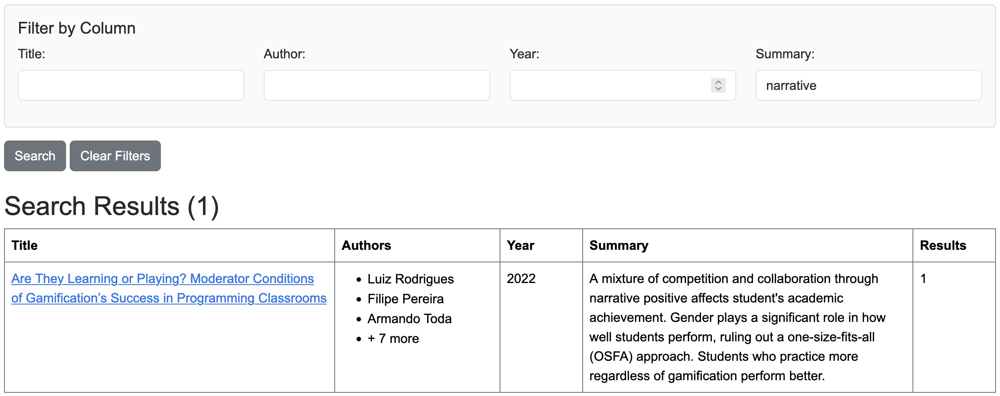
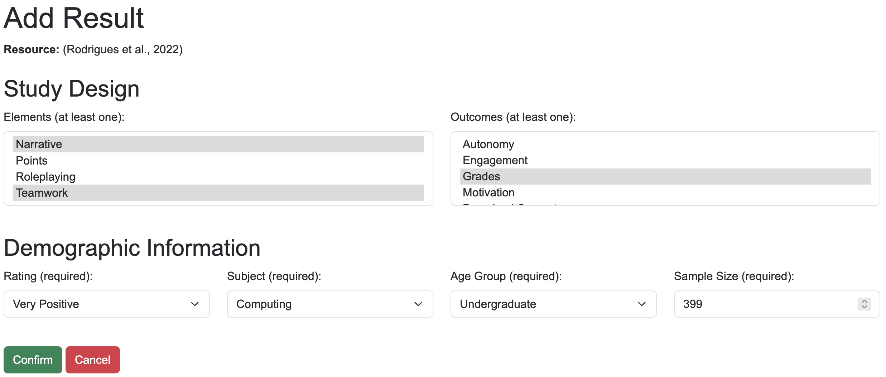
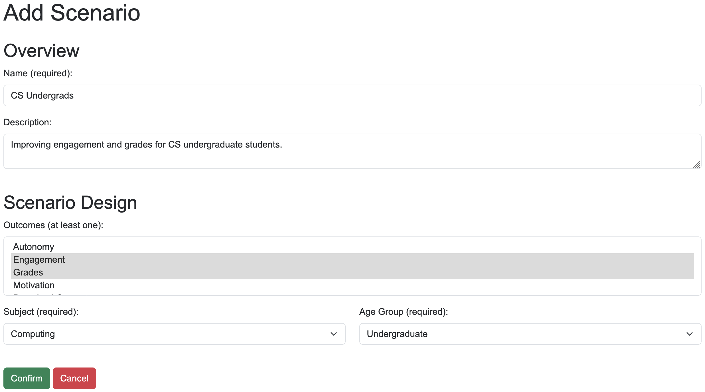
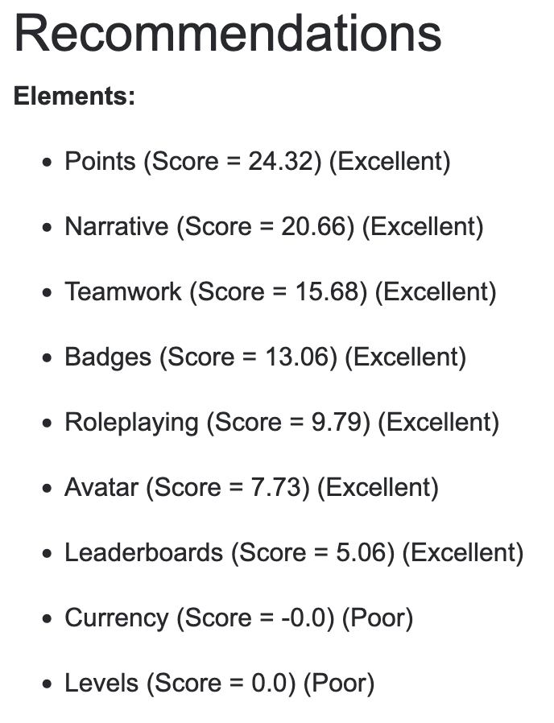
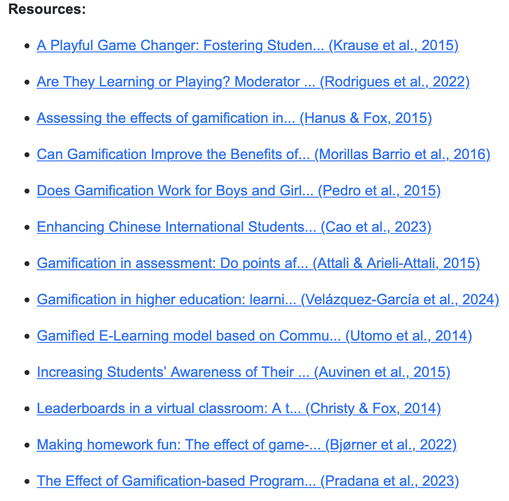

# Gamification Learning Tool

## Description

Gamification is growing more popular by the day, with more and more industries and
sectors using the power of play to drive increased productivity and satisfaction.
But does gamification really work, or is it more hype than truth?

This application is an interactive gamification learning tool for educators with a
user-friendly interface created in the Django web framework.
Simply input your classroom needs, and the website will recommend a solution for you, 
backed by results from published and peer-reviewed scientific studies.

Created as a capstone project for the BS in Computer Science at the University of Virginia.
The [thesis portfolio](https://doi.org/10.18130/gpdm-8857) containing the technical
report and research paper is available on the UVA Library website.

## Instructions

### Development Environment

1. Clone or download this repository using the GitHub website, desktop app,
   or git command line.
2. (**Recommended**) Create a Python virtual environment using `python3 -m venv .venv`.
3. (**Recommended**) Activate the virtual environment using `source .venv/bin/activate` (Unix)
   or `.venv\bin\activate.bat`.
4. Install the required Python packages with `pip3 install -r requirements.txt`.

### Database

1. (_Optional_) Set your production database in [settings.py](mysite/settings.py) under `DATABASES`.
2. Create or migrate your database (`db.sqlite3` by default) with `python3 manage.py migrate`.

### Environment Variables

1. Generate a Django secret key by running `python3 gen_secret_key.py`
2. Copy or rename [.env.blank](.env.blank) to **.env** and paste your secret key there.

### Running the Website

1. Run the local development server by running `python3 manage.py runserver 8000`.
2. Access the website on a web browser at http://127.0.0.1:8000/.
3. (_Optional_) Import the [starter dataset](starter_data.json) by visiting
   [the data management page](http://127.0.0.1:8000/data).

## Screenshots

Add papers to the database and filter them by title, citation, and summary.

Add the variables and results of each experiment to provide data for the recommender.

Create scenarios to specify needs for gamified learning environments.

View recommendations and their relevant resources based on your entered scenario.

## Future Work

This project is a proof-of-concept for data-driven instruction of gamification to laypersons.
The recommender algorithm uses a simple mathematical formula to score elements and is recalculated
each time a scenario page loads.
Further refinements of this recommender could normalize the data to a Z-distribution first,
use a machine learning regression technique instead, and cache commonly-used values to improve speed.
The class (entity-relationship) diagrams and recommender flowchart are also available under
the [diagrams](diagrams) folder.

## Licensing

This tool and the starter dataset are distributed under the permissive MIT license.
Users are free to run, modify, and share this software for their purposes. 

Resources for the dataset were accessed from online databases such as the [ACM Digital Library](https://dl.acm.org),
[ScienceDirect](https://www.sciencedirect.com/), and [IEEE Xplore](https://ieeexplore.ieee.org/Xplore/home.jsp)
under the access of the UVA library.
All descriptions and summaries in the dataset are original work, and no text has been
knowingly copied from their respective sources.
